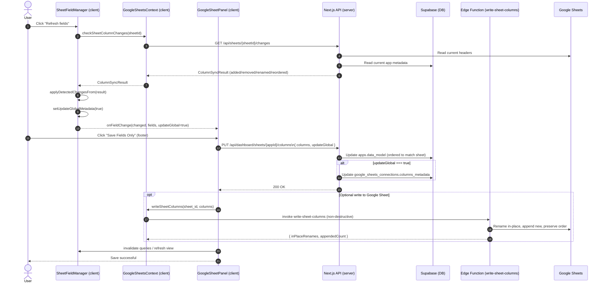

# Google Sheet Field Management Documentation

## Overview

The Praxis AI dashboard's field management system allows users to synchronize, visualize, and modify field metadata between our application database and connected Google Sheets. This document details the field management flow, including change detection, local and global metadata handling, and the save workflow.

## Component Architecture

### Core Components

1. **GoogleSheetPanel** - Parent component managing the sheet panel and providing save controls
2. **SheetFieldManager** - Core component handling field state, change detection, and UI
3. **GoogleSheetsContext** - Context provider for Google Sheets API interactions

### Non-destructive Headers Update (Edge Function)

The Supabase Edge Function at `supabase/functions/write-sheet-columns/index.ts` updates Google Sheet headers in a non-destructive way:

- Renames headers in-place using `originalIndex` or existing name matches
- Preserves existing column order
- Appends new fields at the end
- Does not clear or delete extra columns by default
- Returns response metadata for diagnostics (in-place updates, appended count)

### Data Flow

```

Additionally:

- __SheetFieldManager.tsx__: during sync preview, `buildDisplayedFields()` appends removed preview rows with `id` prefixed by `removed:` so users can see deletions. However, the memo `saveableFields` filters those out before notifying the parent via `onFieldChange`, ensuring preview-only rows are not part of the save payload.

- __API server filter__: `app/api/dashboard/sheets/[sheetId]/columns/route.ts` sanitizes incoming payloads by:
  - Dropping any rows whose `id` starts with `removed:`
  - Normalizing preview IDs (`temp-`, `dup:`) to `undefined`
  - Forcing explicit booleans for `active`
  This applies to both `apps.data_model` and optional `google_sheets_connections.columns_metadata` when `updateGlobal` is true.

### Footer visibility during preview-only removals

When only deletions are detected, the underlying `fields` array may not change. To ensure the footer (Save/Regenerate) still appears, `SheetFieldManager.tsx` reports changes if `syncResult.hasChanges` is true:

```typescript
// In SheetFieldManager.tsx
useEffect(() => {
  if (onFieldChange && fields.length > 0) {
    const changed = Boolean(syncResult?.hasChanges) || hasFieldsChanged();
    onFieldChange(changed, saveableFields, updateGlobalMetadata);
    setIsDirty(changed);
  }
}, [saveableFields, originalFields, onFieldChange, syncResult?.hasChanges, updateGlobalMetadata]);
```
┌───────────────────┐      ┌───────────────────┐      ┌───────────────────┐
│  Google Sheets    │      │  Praxis Database  │      │   SheetFieldManager│
│  (External)       │◄────►│  (Columns API)    │◄────►│   (Local State)    │
└───────────────────┘      └───────────────────┘      └───────────────────┘
                                      ▲
                                      │
                                      ▼
                            ┌───────────────────┐
                            │  GoogleSheetPanel │
                            │  (Save Surface)   │
                            └───────────────────┘
```

## Field Data Structure

```typescript
interface Field {
  id: string;        // Unique identifier
  name: string;      // Column name
  type: string;      // Data type (text, number, date, etc.)
  description: string; // Optional description
  active: boolean;   // Whether the field is included
  options?: string[]; // For dropdown fields
  originalIndex: number; // Position in the sheet
  sampleData?: string[]; // Sample values from the sheet
}
```

## Change Detection Flow

### 1. Refresh and Change Detection

The change detection process begins when a user clicks the "Refresh" button in the `SheetFieldManager`:

```typescript
// In SheetFieldManager.tsx
const handleRefreshClick = async () => {
  if (currentSheetId && isConnected) {
    // Call API to check for changes
    const result = await checkSheetColumnChanges(currentSheetId);
    setSyncResult(result);
    
    // Build change maps for badges
    const map: Record<string, ColumnChange["type"]> = {};
    const rOldToNew: Record<string, string> = {};
    const rNewToOld: Record<string, string> = {};
    
    if (result) {
      // Process each change type
      for (const ch of result.changes) {
        // Map only the target (current) name to avoid collisions; keep rename maps separately
        map[ch.name] = ch.type;
        if (ch.type === 'renamed' && ch.oldName) {
          rOldToNew[ch.oldName] = ch.name;
          rNewToOld[ch.name] = ch.oldName;
        }
      }
      
      // Set state for badges
      setChangeMap(map);
      setRenameOldToNew(rOldToNew);
      setRenameNewToOld(rNewToOld);
      
      // Auto-apply detected changes
      if (result.hasChanges) {
        applyDetectedChangesFrom(result);
        // We don't clear sync state to preserve badges until save
        // Auto-enable global toggle so schema changes can propagate if desired
        setUpdateGlobalMetadata(true);
      }
    }
  }
};
```

### 2. Change Detection API

The backend API uses a two-pointer diff with lookahead to robustly detect changes even when columns shift due to deletions/additions:

- **Added columns** - New columns in the sheet not in our database
- **Removed columns** - Columns in our database not in the sheet
- **Renamed columns** - Identified when both sides advance together but names differ at the aligned position
- **Unchanged** - Explicitly labeled for clarity (reorder is currently inferred via adds/removes/renames)

The API returns a `ColumnSyncResult` object:

```typescript
interface ColumnSyncResult {
  hasChanges: boolean;
  changes: ColumnChange[];
  mergedColumns: any[]; // Combined new column structure
}

interface ColumnChange {
  type: 'added' | 'removed' | 'renamed' | 'unchanged';
  name: string;
  oldName?: string; // For renamed
  index?: number;
}
```

### 3. Applying Detected Changes

When changes are detected, they are automatically applied to the local field state:

```typescript
// In SheetFieldManager.tsx
const applyDetectedChangesFrom = (result: ColumnSyncResult) => {
  const existingByName = new Map<string, Field>(fields.map(f => [f.name, f]));
  const existingById = new Map<string, Field>(fields.map(f => [f.id, f]));
  const renameMapNewToOld = new Map<string, string>();
  
  // Build rename map
  for (const ch of result.changes) {
    if (ch.type === 'renamed' && ch.oldName) {
      renameMapNewToOld.set(ch.name, ch.oldName);
    }
  }
  
  // Process active columns
  const activeMerged = result.mergedColumns.filter((c: any) => !c.isRemoved);
  const newFieldsOrdered: Field[] = activeMerged.map((c: any, idx: number) => {
    // Try to find existing field by name or by id
    let existing = existingByName.get(c.name);
    if (!existing && c.id) {
      existing = existingById.get(String(c.id));
    }
    
    // For renamed fields, check old name
    if (!existing) {
      const oldName = renameMapNewToOld.get(c.name);
      if (oldName) existing = existingByName.get(oldName);
    }
    
    // If existing field found, preserve metadata
    if (existing) {
      return {
        ...existing,
        // Ensure the stored/displayed name reflects the new sheet header
        name: c.name,
        type: existing.type || "text",
        description: existing.description || "",
        options: existing.options || [],
        // Preserve existing Include flag
        active: existing.active === true,
        originalIndex: idx,
      };
    }
    
    // For new fields, create with default values
    return {
      id: `custom-${Date.now()}-${idx}`,
      name: c.name,
      type: "text", // Default type
      description: "",
      options: [],
      active: true,
      originalIndex: idx,
      sampleData: c.sampleData || [],
    };
  });
  
  // Process removed columns
  const removedNames = new Set(
    result.mergedColumns.filter((c: any) => c.isRemoved).map((c: any) => c.name)
  );
  const removedFields: Field[] = [];
  
  for (const name of removedNames) {
    const existing = existingByName.get(name);
    if (existing) {
      // Mark as inactive but preserve other metadata
      removedFields.push({
        ...existing,
        active: false,
        originalIndex: typeof existing.originalIndex === 'number' ? existing.originalIndex : -1,
      });
    }
  }
  
  // Combine and update state
  const updated = [...newFieldsOrdered, ...removedFields];
  setFields(updated);
  setIsDirty(true);
  setUpdateGlobalMetadata(true); // Important for saving global changes
  if (onFieldChange) onFieldChange(true, updated, updateGlobalMetadata);
};
```

## Badge Rendering System

The system uses badges to visually indicate different types of changes. Badge derivation avoids name collisions and follows a clear priority:

- **Red Badge ("Removed")** – Shown first for preview rows appended with `id` starting with `removed:` (true removals only; inactive fields are not marked Removed)
- **Amber Badge ("Renamed")** – Derived from `renameOldToNew` / `renameNewToOld` maps, never from `changeMap` on old names
- **Green Badge ("New")** – From `changeMap[currentName] === 'added'`
- **Gray Badge ("Reordered")** – Optional; if emitted, from `changeMap[currentName] === 'reordered'`

```jsx
// In SheetFieldManager.tsx field rendering
{/* Badge priority: Removed > Renamed > Added > Reordered */}
{(
  field.id.startsWith('removed:')
) && (
  <Badge className="ml-2 text-xs" variant="destructive">Removed</Badge>
)}
{!field.id.startsWith('removed:') && renameOldToNew[field.name] && (
  <Badge className="ml-2 text-xs bg-amber-500 text-white" variant="default">
    {`Renamed → ${renameOldToNew[field.name]}`}
  </Badge>
)}
{!field.id.startsWith('removed:') && !renameOldToNew[field.name] && renameNewToOld[field.name] && (
  <Badge className="ml-2 text-xs bg-amber-500 text-white" variant="default">
    {`Renamed from ${renameNewToOld[field.name]}`}
  </Badge>
)}
{changeMap[field.name] === 'added' && (
  <Badge className="ml-2 text-xs bg-emerald-600 text-white" variant="default">New</Badge>
)}
{changeMap[field.name] === 'reordered' && (
  <Badge className="ml-2 text-xs" variant="secondary">Reordered</Badge>
)}
```

## Local and Global Metadata

### Local Metadata

Local metadata refers to field properties that are specific to a single app, including:

- Field visibility (active state)
- Ordering within the app
- App-specific descriptions

### Global Metadata

Global metadata affects all apps using the same Google Sheet connection, including:

- Field types
- Field names
- Default options for dropdown fields

The system tracks whether detected changes should update global metadata:

```typescript
// In SheetFieldManager.tsx
const [updateGlobalMetadata, setUpdateGlobalMetadata] = useState(false);

// Auto-enable when sheet structure changes are detected
if (result.hasChanges) {
  applyDetectedChangesFrom(result);
  setUpdateGlobalMetadata(true);
}
```

## Save Workflow

### 1. Save Field Changes

When the user clicks "Save Fields Only" in the `GoogleSheetPanel`, we persist only real columns. Preview-only removed rows (with IDs starting `removed:`) are filtered out at three layers.

```typescript
// In GoogleSheetPanel.tsx
const handleSaveFieldsOnly = async () => {
  try {
{{ ... }}
// The mutation function
const saveFieldsMutation = useMutation({
  mutationFn: async () => {
    // Use modified fields from SheetFieldManager
    let columnsToSave = modifiedFields;

    // Final defensive filter: never persist preview-removed rows
    const columnsSansRemoved = (columnsToSave || []).filter((col: any) => !String(col?.id || '').startsWith('removed:'));

    // Ensure boolean values are explicitly set
    const columnsWithExplicitBooleans = columnsSansRemoved.map(col => ({
      ...col,
      active: col.active === true // Force explicit boolean conversion
    }));
    
    // Save to database (apps.data_model). When updateGlobal is true,
    // the server also updates google_sheets_connections.columns_metadata.
    // Preview-only rows are excluded on save:
    //  - Removed rows (id starts with "removed:")
    //  - Inactive rows (active === false)
    //  - Temporary IDs (id starts with "temp-") are stripped
    const response = await fetch(
      `/api/dashboard/sheets/${app.id}/columns`,
      {
        method: "PUT",
        headers: { "Content-Type": "application/json" },
        body: JSON.stringify({ 
          columns: columnsWithExplicitBooleans,
          updateGlobal: updateGlobal // captured from SheetFieldManager via onFieldChange
        }),
      }
    );
    // Optionally, after saving, the app may write canonical headers to the
    // Google Sheet via the Edge Function (non-destructive). This is handled
    // via GoogleSheetsContext.writeSheetColumns where implemented.
  },
  
  // Reset state on success
  onSuccess: () => {
    toast.success("Field metadata has been saved successfully.");
    setHasChanges(false);
    setModifiedFields(null);
    
    // Force refresh of SheetFieldManager / columns view
    queryClient.invalidateQueries({ queryKey: ["sheet-columns", app?.id] });
    setFieldsVersion((v) => v + 1); // Forces remount
  }
});
```

### Global Toggle Wiring

- `SheetFieldManager.tsx` exposes `onFieldChange?: (changed: boolean, fields?: Field[], updateGlobal?: boolean)`
- It calls `onFieldChange(changed, saveableFields, updateGlobalMetadata)` whenever fields/toggle change
- `GoogleSheetPanel.tsx` captures the third arg and stores it in `const [updateGlobal, setUpdateGlobal] = useState(false)`
- The footer "Save Fields Only" sends `updateGlobal` in the PUT body

### 2. Regenerate App

The "Save & Regenerate App" button triggers a complete app rebuild:

```typescript
// In GoogleSheetPanel.tsx
const regenerateAppMutation = useMutation({
  mutationFn: async () => {
    // First save fields
    await saveFieldsMutation.mutateAsync();
    
    // Then trigger regeneration
    const response = await fetch(`/api/dashboard/apps/${app.id}/regenerate`, {
      method: "POST"
    });
  }
});
```

## Special Cases

### User Edits to Detected Changes

When a user edits a newly detected column before saving:

1. The edit is applied to the local state with `handleConfirmEdit()`
2. The field retains its badge until save
3. When saved, both the database and Google Sheet reflect the edited value

### Renaming Columns in the UI

When a user renames a column in the UI:

1. The change is tracked in local state
2. On save, both our database and the Google Sheet are updated
3. The column name is changed in the actual Google Sheet via the `writeSheetColumns()` function

## API Endpoints

### Column Management

- **GET /api/dashboard/sheets/[sheetId]/columns** - Get columns for an app
- **PUT /api/dashboard/sheets/[sheetId]/columns** - Update columns for an app; optionally updates global metadata when `updateGlobal` is true
- **GET /api/sheets/[sheetId]/columns** - Get raw columns from Google Sheet
- Writing headers to Google Sheets is performed by a Supabase Edge Function (invoked server-side) and may be called via `GoogleSheetsContext.writeSheetColumns(...)` where implemented

### Sync and Change Detection

- **GET /api/sheets/[sheetId]/changes** - Compare Google Sheet with database and detect changes

## Best Practices

1. **Enable Global Metadata Updates** when making structural changes that should affect all apps using the sheet
2. **Clear alerts** after reviewing change information
3. **Save frequently** to ensure changes are persisted
4. **Regenerate the app** after significant field changes to ensure proper functionality

## Troubleshooting

- **apps.data_model updates but columns_metadata does not**: Ensure the footer save sends `updateGlobal: true`. The toggle state from `SheetFieldManager` must be propagated via `onFieldChange` and used by the footer.
- **Duplicate headers in the sheet**: The Edge Function uses a non-destructive strategy (rename in-place, append new, do not clear extras). Verify canonical columns and ordering; ensure nothing else is clearing headers.
- **Order mismatches between DB and sheet**: Preserve `originalIndex` when building save payload; the saved order should mirror the live sheet headers.

## Sequence Diagram

